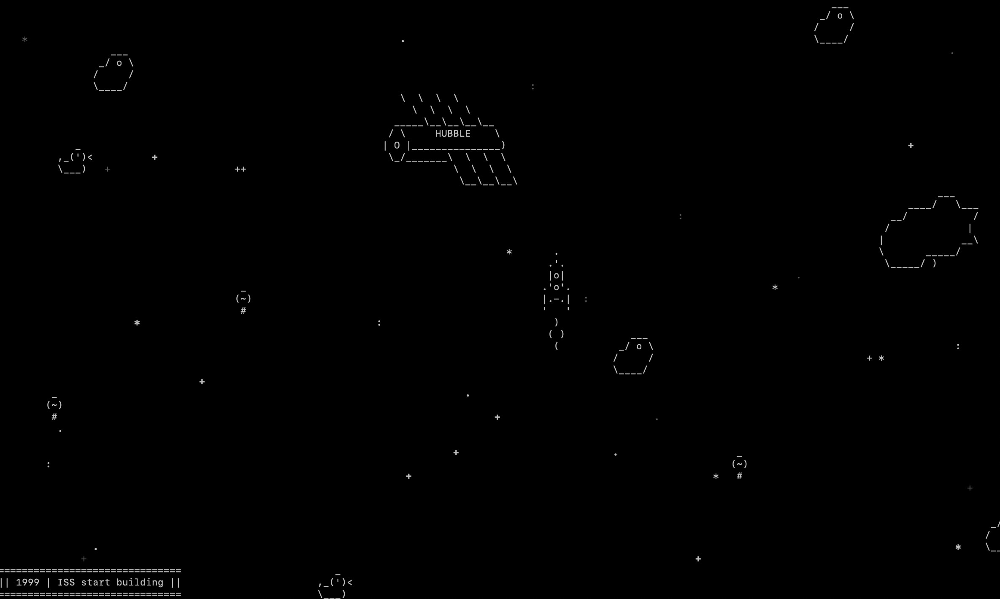

# Space Game using asyncio
[Lessons 1,2 from Devman Course](https://dvmn.org/modules/async-python/)


A simple space game using `asyncio` and `curses`. 

## Environment
* Python 3.6 and higher
* uses `curses` and `asyncio` modules from the Python standard library

## How to play

### Clone the repository
```bash
git clone --recursive https://github.com/artbataev/dvmn_async_spaceship.git
cd dvmn_async_spaceship
```

### Run the game
```bash
python3 main.py
```
or
```bash
./main.py
```

Avoid space obstacles using keyboard arrows. Destroy obstacles using `space`.
